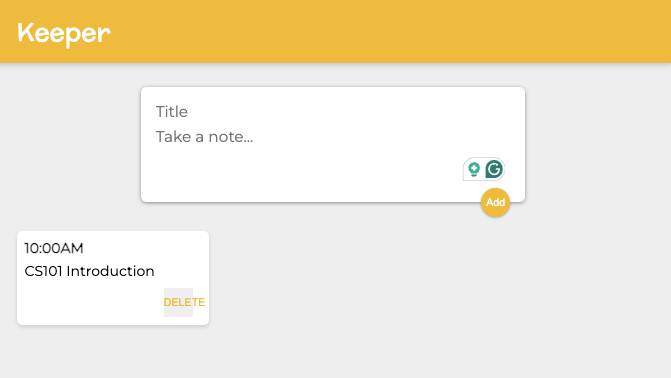

# 📝 Keeper App - A Simple Notes App

A **React-based note-taking app** Easily add, delete, and manage your notes.

<!-- ## 🚀 Live Demo
🔗 **[Try the App Here](https://kzmaybe.github.io/Keeper-App/)** -->

## 🛠️ Technologies Used
- **React.js** – Component-based UI  
- **CSS** – Custom styles  
- **JavaScript (ES6)** – Logic & state management  
- **GitHub Pages** – Live hosting  

## 📸 Features
✅ **Add & Delete Notes**  
✅ **Minimal UI Design**  
✅ **Responsive Layout**  

## 🖥️ How to Run Locally
### If you're running this locally in VS Code use the commands:
- **to install the node modules** - npm install
- **to launch the react project in your browser** - npm run dev
